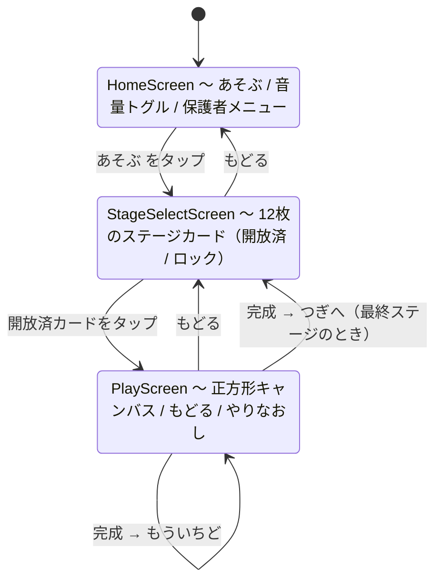

# 2〜3歳向け プレデッサン学習アプリ「PreSketch」要件定義書

- **文書バージョン**: 1.0
- **作成日**: 2026-08-29
- **想定読者**: 本アプリを実装する AI コーディングエージェント（Antigravity / Claude Code 等）および人間の開発者
- **前提**: この文書だけを読めば実装を開始できること。外部文脈を参照する必要はない。

---

## 0. この文書の読み方（実装者への注意）

本書が本アプリの唯一の仕様である。**本書の記述が常に優先される。**

実装時に判断に迷ったら、以下の優先順位で決めること。

1. 本書の明示的な記述
2. 第2章「確定した設計判断」の背景説明（なぜそう決めたか）
3. 「2〜3歳児が失敗体験をしないこと」を優先する

**推測で仕様を追加しないこと。** 本書に書かれていない機能は第15章「スコープ外」に該当する可能性が高い。

---

## 1. プロジェクト概要

### 1.1 背景と教育的アプローチ

一般的な「デッサン」（陰影・パース・写実的描写）は空間認知と微細運動能力の発達上、9歳以降が適齢期である。
2〜3歳の発達段階（なぐりがき期〜象徴期）における本アプリのゴールは、デッサンそのものではなく、
**「すべての絵は ○・△・□ の基本形態からできている」というゲシュタルト把握（形態認知）を、遊びながら身体で体感すること**にある。

### 1.2 コア体験

| 要素 | 内容 |
|---|---|
| **運筆** | 画面をなぞると線が引ける。なぞっている間、光の粒子と音が反応する |
| **形態の単純化** | 複雑な対象（車・リンゴ・家・猫）を ○△□ に分解してなぞる |
| **達成感（見立て遊び）** | なぞり終えると自動で色がつき、絵に命が吹き込まれる |

### 1.3 このアプリの技術的な実体

| 要素 | 実体 |
|---|---|
| サーバー | **無し**（静的ファイルのみ） |
| データベース | **無し**（進捗は端末内 localStorage） |
| ネットワーク通信 | **無し**（完全オフライン動作） |
| 画像アセット | **無し**（図形は座標から Canvas に描画） |
| 音声アセット | **無し**（Web Audio API で合成） |
| 画面数 | 3（Home / StageSelect / Play） |

**難所は1箇所に集中している**: 「指の座標列」と「お手本の座標列」を突き合わせて "なぞれた" と判定するロジック（第6章）。
それ以外は素直な React 実装である。

### 1.4 対応環境

| 区分 | 環境 | 位置づけ |
|---|---|---|
| **主対象** | iPad Safari（iPadOS 16 以降） | 子どもが実際に使う |
| **主対象** | **Android Chrome（Android 10 以降）** | 子どもが実際に使う |
| 副対象 | デスクトップ Chrome / Edge / Safari | 開発と動作確認 |
| 対象外 | Internet Explorer、旧 Edge、Firefox for Android | 動けばよいが保証しない |

**主対象の2つは同等に扱う。**「iPad で動けばよい」という前提を置かないこと。
Android は端末ごとに DPR・画面比・性能の幅が大きく、iOS より条件が厳しい場面がある（第8.4節）。

3環境すべてを **Pointer Events の単一コードパス**で扱う。
**UA 判定による分岐を書かないこと。** 本書に記載した対策はすべて全環境で有効である。

---

## 2. 確定した設計判断（決定ログ）

実装者が「なぜこうなっているのか」で迷わないよう、決定の背景を残す。**これらを独断で変更しないこと。**

### 決定1: 成果物は Web アプリ。Capacitor は導入しない

- **決定**: ブラウザで動作する静的 Web アプリとして完成させる。ネイティブ化は将来の課題とする
- **理由**: 開発環境が Windows であり、JDK・Android SDK・Xcode のいずれも未導入。
  iOS ビルドは macOS 必須のため原理的に不可能。Android も 5〜10GB の環境構築を要する
- **重要**: Capacitor の価値は「ストアに並べること」であって「iPad で動かすこと」ではない。
  iPad の Safari で URL を開き「ホーム画面に追加」すれば、全画面のアイコン起動になり、
  2〜3歳児の体験としてはネイティブアプリとほぼ区別がつかない
- **制約**: 将来 `npx cap add ios` でコードを書き直さずネイティブ化できる作りを維持すること。
  具体的には「Node.js 固有 API を使わない」「絶対パスの前提を持たない」「localStorage 以外の永続化を使わない」

### 決定2: React 19 + Vite

- Node v24.19.0 / npm 11.2.0 の環境で問題なく動作する
- `npm create vite@latest -- --template react-ts` の既定構成をそのまま使う

### 決定3: 進捗の保存先は localStorage

- **理由**: 将来 Capacitor でネイティブ化しても localStorage はそのまま動作するため、書き直しが発生しない
- Capacitor Preferences API は使わない

### 決定4: キャンバスは常に「正方形」にする ★重要

- **決定**: キャンバスの描画領域は常に正方形（縦横同一 px）とし、画面中央に配置する。
  余白は背景色で埋める（レターボックス）
- **理由**: 座標系を 0.0〜1.0 に正規化しているため、**非正方形キャンバスではユークリッド距離が歪む**。
  例: 800×450 のキャンバスで `tolerance = 0.08` を使うと、横方向は 64px、縦方向は 36px となり、
  判定領域が真円ではなく楕円になる。「縦線は当たりやすいのに横線は厳しい」という
  原因のわかりにくい違和感として表面化する
- **効果**: 正方形にすれば**アスペクト比の補正コードが1行も要らない**。
  さらに iPad の縦持ち／横持ちの両方で図形が同じ形で出るため、画面の向きを固定する必要がなくなる

### 決定5: 画面の向きは固定しない

- 決定4の帰結。縦向きでも横向きでも、正方形キャンバスが中央に表示される
- 2〜3歳児が本体を回しても表示が破綻しない

### 決定6: 星（stars）は「クリアの印」として常に1個

- **決定**: `stars` の値は常に `1`。上手さによって数を変えない
- **理由**: 2〜3歳に成績評価は不要。星の数が変動すると「星1個しか取れなかった」という
  失敗体験になり、本アプリの設計思想（失敗体験を作らない）に反する
- 型定義に `stars: number` を残すのは将来の拡張余地のため

### 決定7: なぞり判定は「順序あり・寛容」方式 ★重要

- **決定**: 点線を無視して画面を塗りつぶすように動かしても**クリアにしない**。
  始点から順に通過したかを追跡する。ただし逆走・指離し・多少の飛ばしには寛容にする
- **理由**: 順序を検証しない実装（各お手本点の近くを「いつか」通ったかだけを見る方式）にすると、
  画面をぐしゃぐしゃに塗るだけで 100% クリアできてしまう。「なぞる」ことを教えるアプリで、
  なぞらなくてもクリアできると形態認知の学習が成立しない
- **寛容さの担保**: 2〜3歳児は指を離すし逆走もする。それらは第6章のアルゴリズムで吸収する

---

## 3. 技術スタック

| レイヤー | 技術 | 選定理由 |
|---|---|---|
| Frontend | React 19 + TypeScript + Vite | 高速ビルド、型安全、コンポーネント指向 |
| Styling | Tailwind CSS | 幼児向けの大胆でカラフルな UI を高速構築 |
| 描画エンジン | HTML5 Canvas 2D（Vanilla API） | 外部描画ライブラリ依存を排除し、低遅延・高フレームレートを維持 |
| 入力 | **Pointer Events API** | マウス・タッチ・ペンを単一の API で扱え、`pointerId` で指を識別できる |
| 音声 | Web Audio API（合成） | 外部音声ファイル不要。軽量・低遅延 |
| 演出 | canvas-confetti | クリア時の紙吹雪 |
| アイコン | lucide-react | UI アイコン |
| 状態管理 | React `useState` / `useReducer` | 画面が3つしかないため専用ライブラリは不要 |
| ルーティング | **使わない** | 幼児がブラウザの戻るボタンで意図せず離脱するのを防ぐ |

### 使用しないもの（明示）

- React Router（決定: `useState` の状態遷移で足りる）
- Redux / Zustand / Jotai 等の状態管理ライブラリ
- Konva / Fabric.js / p5.js 等の描画ライブラリ
- Capacitor（第2章 決定1）
- 外部 API・バックエンド・認証

---

## 4. 画面構成と遷移

### 4.1 画面遷移図



ロック済みカードのタップは**遷移しない**（音も鳴らさない）。
ブラウザの戻る操作については第8.4節を参照。

状態は `App.tsx` が保持する。

```ts
type Screen =
  | { name: 'home' }
  | { name: 'stageSelect' }
  | { name: 'play'; stageId: string };
```

### 4.2 各画面の要件

#### HomeScreen

- 中央に巨大な「あそぶ」ボタン（画面幅の 50% 以上）
- 音量トグル（アイコンのみ。ON/OFF が一目でわかること）
- 保護者メニューへの入口（**ペアレンタルゲートで保護**、第4.3節）
- タイトルロゴはテキストではなく ○△□ を組み合わせた図形で表現する

#### StageSelectScreen

- 12枚のカードをグリッド表示（ステージ番号順）
- カードには**文字を使わず**、そのステージで描く図形のシルエットを表示する
- 状態は3種類
  - **クリア済**: 図形がテーマカラーで塗られ、星が1個灯る
  - **開放済（未クリア）**: 図形が点線で表示される
  - **ロック**: 錠前アイコンのみ。タップしても反応しない（音も鳴らさない）
- 初期状態では `stage_1_1` のみ開放
- あるステージをクリアすると次のステージが開放される

#### PlayScreen

- 正方形キャンバス（中央配置）
- 「もどる」ボタン（左上、64×64px 以上）
- 「やりなおし」ボタン（右上、64×64px 以上）
- 画面上部にお手本アニメーション（第10.1節）
- 完成時に完成モーダル（第10.3節）

### 4.3 ペアレンタルゲート（保護者ロック）

以下の操作は幼児が誤って到達できないよう保護する。

- 設定画面
- 全ステージ強制開放
- 進捗のリセット
- 外部リンク（本バージョンでは存在しないが、将来のため機構は用意する）

**方式**: ボタンを **3秒間長押し** させる。長押し中は円形のプログレスインジケータを表示し、
指を離すとリセットされる。2〜3歳児は3秒間同じ場所を押し続けることが困難であるため、これで足りる。

### 4.4 幼児向け UI 原則（全画面共通）

- **すべてのタップ対象は `min-width: 64px; min-height: 64px` 以上**
- 機能を示す文字を UI に使わない（アイコンと図形のみ）。ひらがなは装飾・モチーフ名のみ
- 破壊的操作（進捗リセット等）はペアレンタルゲートの内側にのみ置く
- 押せないものは押せないように見せる（ロック状態は明確に暗くする）
- アニメーションは 200〜400ms。速すぎると認知できず、遅すぎると待てない

---

## 5. 座標系とキャンバス

### 5.1 正規化座標

すべてのガイドパスの座標は **0.0〜1.0 の正規化座標**で定義する。

```
(0,0) ─────────── (1,0)
  │                 │
  │    キャンバス    │   ← 常に正方形
  │                 │
(0,1) ─────────── (1,1)
```

- 画面解像度・デバイスに依存しない
- 距離計算がそのまま「キャンバス幅に対する割合」を意味する

### 5.2 キャンバスのサイズ決定ロジック

ビューポートに収まる最大の正方形を求め、上限を設ける。

```ts
const MAX_CANVAS_SIZE = 900;
const side = Math.min(
  window.innerWidth  - PADDING * 2,
  window.innerHeight - HEADER_HEIGHT - PADDING * 2,
  MAX_CANVAS_SIZE
);
```

- `resize` および `orientationchange` イベントで再計算する
- **DPR（devicePixelRatio）対応必須**。Retina で線がぼやけないようにする

```ts
const dpr = window.devicePixelRatio || 1;
canvas.width  = side * dpr;
canvas.height = side * dpr;
canvas.style.width  = side + 'px';
canvas.style.height = side + 'px';
ctx.setTransform(dpr, 0, 0, dpr, 0, 0);
```

### 5.3 座標変換

```ts
// 正規化座標 → キャンバス上の CSS ピクセル座標
const toCanvas = (p: Point, side: number) => ({ x: p.x * side, y: p.y * side });

// ポインタイベント → 正規化座標
const toNormalized = (e: PointerEvent, canvas: HTMLCanvasElement): Point => {
  const rect = canvas.getBoundingClientRect();
  return {
    x: (e.clientX - rect.left) / rect.width,
    y: (e.clientY - rect.top)  / rect.height,
  };
};
```

### 5.4 ビューポート高の変動への対応 ★Android Chrome で重要

Android Chrome はスクロールや操作に応じてアドレスバーが出入りし、**`window.innerHeight` が動的に変わる**。
キャンバスサイズを `innerHeight` から算出しているため、素朴に実装すると
**プレイ中にキャンバスが突然リサイズされ、描いている途中の線が消える**という事故が起きる。

対策は4つ。すべて実施すること。

1. CSS の高さは **`100dvh`（dynamic viewport height）**を使う。`100vh` は使わない
2. `resize` / `orientationchange` はそのまま拾わず、**150ms のデバウンス**をかける
3. **ポインタ追跡中（`activeId.current !== null`）はリサイズを保留する。** 指が離れてから適用する
4. リサイズ適用時は、ユーザーの軌跡を新しいサイズで**描き直す**

```ts
const pendingResize = useRef(false);

const applyResize = () => {
  if (activeId.current !== null) { pendingResize.current = true; return; } // 描画中は触らない
  // side を再計算 → canvas を再設定 → 軌跡を再描画
};

// pointerup / pointercancel の最後で
if (pendingResize.current) { pendingResize.current = false; applyResize(); }
```

**軌跡を正規化座標で保持していること**（第5.1節）が前提である。
CSS ピクセルで保持していると、リサイズや画面回転のたびに図形が崩れる。

---

## 6. なぞり判定アルゴリズム ★本アプリの中核

### 6.1 設計目標

| 満たすこと | 満たさないこと |
|---|---|
| 始点から順になぞらないと進まない | ピクセル単位の厳密な一致 |
| 指を離しても進行度が消えない | 逆走をエラーにする |
| 多少の飛ばし・はみ出しを許す | 制限時間・ゲームオーバー |
| 画面の塗りつぶしでクリアできない | 描画の美しさの評価 |

### 6.2 チェックポイント方式

各ガイドパスは、等間隔に配置されたチェックポイントの配列に変換される。

```
始点                                        終点
 ●───●───●───●───●───●───●───●───●───●───●
 0   1   2   3   4   5   6   7   8   9   10

 各 ● の周囲 tolerance の円内に指が入れば「通過」
```

- **チェックポイント間隔**: 正規化距離で `0.05`（定数 `CHECKPOINT_STEP`）
- **判定許容半径**: 正規化距離で `0.08`（定数 `DEFAULT_TOLERANCE`）
  - 700px のキャンバスなら実寸 56px。2〜3歳児の指の接地面積を考えると妥当
  - ステージごとに `PathSegment.toleranceRadius` で上書き可能

### 6.3 進行アルゴリズム（Progressive Cursor with Lookahead）

**本アプリで最も重要なロジックである。ここを簡略化しないこと。**

```ts
export type TraceState = {
  cursor: number;      // 次に通過すべきチェックポイントの index
  passed: boolean[];   // 各チェックポイントの通過フラグ
  started: boolean;    // 始点に触れて開始済みか
  onPathRate: number;  // 入力点がガイド上にあった割合の指数移動平均。初期値 1.0
};

export const createTraceState = (n: number): TraceState => ({
  cursor: 0,
  passed: new Array(n).fill(false),
  started: false,
  onPathRate: 1,
});

const LOOKAHEAD = 3;           // 3個先までなら飛ばしを許容
const ON_PATH_ALPHA = 0.02;    // on-path 率の指数移動平均の係数

/**
 * 指の現在位置 p を受け取り、進行状態を更新して返す（純関数）。
 */
export const advanceTrace = (
  state: TraceState,
  checkpoints: Point[],
  p: Point,
  tolerance: number
): TraceState => {
  if (checkpoints.length === 0) return state;

  // --- 開始判定: 始点付近に触れるまで何も進めない ---
  if (!state.started) {
    if (dist(p, checkpoints[0]) > tolerance) return state;
    return advanceTrace({ ...state, started: true }, checkpoints, p, tolerance);
  }

  // --- on-path 率の更新（開始以降のすべての点が対象。第6.6節）---
  // パス全体のどのチェックポイントかに近ければ on-path とみなす。
  // 「カーソル近傍のみ」にすると、仕様で許容している逆走が off-path 扱いになる。
  const onPath = checkpoints.some((c) => dist(p, c) <= tolerance) ? 1 : 0;
  const counted: TraceState = {
    ...state,
    onPathRate: state.onPathRate * (1 - ON_PATH_ALPHA) + onPath * ON_PATH_ALPHA,
  };

  if (counted.cursor >= checkpoints.length) return counted;

  // --- 進行判定: cursor から LOOKAHEAD 先までを順に見る ---
  const end = Math.min(counted.cursor + LOOKAHEAD, checkpoints.length - 1);
  for (let i = counted.cursor; i <= end; i++) {
    if (dist(p, checkpoints[i]) <= tolerance) {
      const passed = [...counted.passed];
      // 飛ばした分もまとめて通過扱いにする（寛容さの担保）
      for (let j = counted.cursor; j <= i; j++) passed[j] = true;
      return { ...counted, passed, cursor: i + 1 };
    }
  }
  return counted; // どこにも当たらなければ進まない（＝失敗ではない）
};

export const traceProgress = (state: TraceState): number =>
  state.passed.length === 0 ? 0 : state.passed.filter(Boolean).length / state.passed.length;
```

### 6.3.1 なぜ on-path 率が必要か ★重要

**進行度の順序チェックだけでは、直線を使うステージの塗りつぶしを防げない。**

直線上のチェックポイントは一列に並んでいるため、指が線の上を往復すれば
必然的に順序どおりに通過する。順序制約が何も制約していない。実測値は以下のとおり。

| 対象 | 塗りつぶし入力の点数 | 順序チェックあり | 順序チェックなし |
|---|---|---|---|
| 直線 | 1000 | **71.4%（クリア成立）** | 71.4% |
| 直線 | 3000 | 71.4% | 71.4% |
| 円 | 3000 | 9.5% | 90.5% |
| 円 | 10000 | 73.8%（クリア成立） | 100% |

円などの閉じた図形では順序チェックが有効に働くが、直線では効果がゼロである。

そこで進行度とは別に「入力点がガイド上にあった割合（on-path 率）」を持ち、
完成条件を二つにする。実測した分離は明確である。

| 入力の種類 | on-path 率 |
|---|---|
| ぐしゃぐしゃ描き（直線） | 5.9 〜 15.3% |
| ぐしゃぐしゃ描き（円） | 23.0 〜 30.3% |
| なぞり σ=0.04 | 89.3 〜 96.4% |
| なぞり σ=0.06 | 76.2 〜 87.5% |
| **なぞり σ=0.08（かなり雑）** | **66.7 〜 71.4%** |

`ON_PATH_THRESHOLD = 0.5` は、塗りつぶしの最大 30.3% と雑ななぞりの最小 66.7% のほぼ中間にある。

**累積平均ではなく指数移動平均を使うこと。** 累積平均にすると
「最初にさんざん塗りつぶした子が、その後まじめになぞっても率が回復せず永久にクリアできない」
という失敗状態が生まれ、第2章 決定7（失敗体験を作らない）に反する。

### 6.4 このアルゴリズムが要件を満たす理由

| 要件 | 満たされ方 |
|---|---|
| 塗りつぶしでクリアできない | **2段構え**。閉じた図形は `cursor` の順序チェックが効く（3個先までしか進まない）。直線は順序チェックが効かないため、**on-path 率のゲートで止める**（第6.3.1節） |
| 逆走してもよい | 逆走時は `cursor` より手前の点に触れるだけ。ループが空振りして `cursor` が変わらない。減点も発生しない。逆走中も指はガイド上にあるため on-path 率は下がらない |
| 指を離してよい | `TraceState` は `pointerup` でリセットしない。次に触れた時、`cursor` の位置から再開する |
| 多少の飛ばしを許す | `LOOKAHEAD = 3` と、飛ばした区間をまとめて `passed` にする処理 |
| 失敗が存在しない | 判定に失敗を表す状態がない。前進しないだけ。on-path 率も指数移動平均なので、雑に描いた後にまじめになぞれば回復する |

### 6.5 完成判定

```ts
const COMPLETION_THRESHOLD = 0.7; // 進行度の閾値
const ON_PATH_THRESHOLD = 0.5;    // ガイド上に居た割合の下限

/** 1つのパスが完了しているか。進行度と on-path 率の両方を満たすこと */
export const isPathComplete = (s: TraceState): boolean =>
  traceProgress(s) >= COMPLETION_THRESHOLD && s.onPathRate >= ON_PATH_THRESHOLD;

export const isStageComplete = (states: TraceState[]): boolean =>
  states.length > 0 && states.every(isPathComplete);
```

- 複数パスを持つステージ（例: Stage 1-1 の3本の線）は、**すべてのパスが個別に条件を満たす**必要がある
- どのパスから描き始めてもよい。`pointerdown` の位置から、**未完成パスのうち最も近いもの1つ**を
  判定対象として選び、そのストロークの間はそのパスだけを進める

**選択したパス以外に入力点を流し込まないこと。** 全パスに流すと、図形が重なるステージで
なぞっていないパスが勝手に進む。実測では Stage 4-3（ねこさん）で顔の円をなぞるだけで
**左耳が 60% 進み**、閾値 70% に対してほぼ描かずにクリアできてしまう。

```ts
/** 未完成パスのうち、指の位置に最も近いものを選ぶ */
const pickPath = (p: Point, paths: PathSegment[], states: TraceState[]): number => {
  let best = -1, bestD = Infinity;
  paths.forEach((path, i) => {
    const st = states[i];
    if (!st || isPathComplete(st)) return;          // 完成済みは対象外
    // 開始済みなら現在のカーソル位置、未開始なら始点を基準に測る
    const anchor = st.started
      ? path.points[Math.min(st.cursor, path.points.length - 1)]
      : path.points[0];
    const d = dist(p, anchor);
    if (d < bestD) { bestD = d; best = i; }
  });
  return best;
};
```

開始済みのパスでカーソル位置を基準にするのは、**指を離して途中から再開する動作を素直に扱うため**である。

### 6.6 パス生成ヘルパー（`utils/geometry.ts`）

チェックポイント配列を手で書かず、パラメータから生成する。

```ts
export type Point = { x: number; y: number };

export const dist = (a: Point, b: Point) => Math.hypot(a.x - b.x, a.y - b.y);

/** 直線を等間隔のチェックポイント列に変換 */
export const linePoints = (from: Point, to: Point, step = 0.05): Point[] => {
  const n = Math.max(2, Math.ceil(dist(from, to) / step));
  return Array.from({ length: n + 1 }, (_, i) => ({
    x: from.x + (to.x - from.x) * (i / n),
    y: from.y + (to.y - from.y) * (i / n),
  }));
};

/** 円（既定で真上から時計回り） */
export const circlePoints = (
  c: Point, r: number, step = 0.05, startAngle = -Math.PI / 2
): Point[] => {
  const n = Math.max(8, Math.ceil((2 * Math.PI * r) / step));
  return Array.from({ length: n + 1 }, (_, i) => {
    const a = startAngle + (2 * Math.PI * i) / n;
    return { x: c.x + r * Math.cos(a), y: c.y + r * Math.sin(a) };
  });
};

/** 多角形（closed=true で最初の頂点に戻る） */
export const polygonPoints = (
  verts: Point[], step = 0.05, closed = true
): Point[] => {
  const vs = closed ? [...verts, verts[0]] : verts;
  const out: Point[] = [];
  for (let i = 0; i < vs.length - 1; i++) {
    const seg = linePoints(vs[i], vs[i + 1], step);
    out.push(...(i === 0 ? seg : seg.slice(1))); // 頂点の重複を除く
  }
  return out;
};

/** 渦巻き（Stage 1-3 用） */
export const spiralPoints = (
  c: Point, rStart: number, rEnd: number, turns: number, step = 0.05
): Point[] => {
  const total = 2 * Math.PI * turns;
  const n = Math.max(16, Math.ceil((2 * Math.PI * ((rStart + rEnd) / 2) * turns) / step));
  return Array.from({ length: n + 1 }, (_, i) => {
    const t = i / n;
    const a = total * t;
    const r = rStart + (rEnd - rStart) * t;
    return { x: c.x + r * Math.cos(a), y: c.y + r * Math.sin(a) };
  });
};
```

---

## 7. 描画エンジン仕様

### 7.1 レイヤー構成

**3枚の canvas 要素を重ねる**（`position: absolute` で同一領域に配置）。

| z | レイヤー | 内容 | 再描画頻度 |
|---|---|---|---|
| 1 | **ガイド層** | 点線のお手本、始点マーカー | ステージ切替時のみ |
| 2 | **描画層** | ユーザーが引いたクレヨン線、完成時の塗りつぶし | ポインタ移動時 |
| 3 | **演出層** | キラキラ粒子、お手本の指、紙吹雪 | `requestAnimationFrame` で毎フレーム |

**理由**: ガイド層を毎フレーム描き直すのは無駄であり、粒子演出のためにユーザーの線を消してしまう事故も防げる。

### 7.2 ガイド層の描画

```ts
ctx.setLineDash([12, 14]);
ctx.lineWidth = 6;
ctx.strokeStyle = 'rgba(0,0,0,0.18)';
ctx.lineCap = 'round';
```

- チェックポイント配列をそのまま `lineTo` で結ぶ
- 始点には「ここから」を示す色付きの丸（半径 14px、テーマカラー）を描く
- 未完成パスの始点は脈打つように拡縮させ、次にどこを触ればよいか示す

### 7.3 描画層：ユーザーの線

| 項目 | 値 |
|---|---|
| 線幅 | 20px（定数 `STROKE_WIDTH`、16〜24px の範囲で調整可） |
| 端点・接合 | `lineCap = 'round'`, `lineJoin = 'round'` |
| 色 | `StageData.themeColor` |
| 平滑化 | 二次ベジェ曲線による補間（第 7.4 節） |

### 7.4 二次ベジェ平滑化

幼児の指タッチは小刻みに震えるため、点をそのまま直線で結ぶとギザギザになる。
**連続する2点の中点をアンカーにした二次ベジェ曲線**で補間する。

```ts
export const drawSmoothPath = (
  ctx: CanvasRenderingContext2D, pts: Point[], side: number
) => {
  if (pts.length < 2) return;
  const c = (p: Point) => ({ x: p.x * side, y: p.y * side });

  ctx.beginPath();
  const p0 = c(pts[0]);
  ctx.moveTo(p0.x, p0.y);

  for (let i = 1; i < pts.length - 1; i++) {
    const cur = c(pts[i]);
    const nxt = c(pts[i + 1]);
    const mid = { x: (cur.x + nxt.x) / 2, y: (cur.y + nxt.y) / 2 };
    // 現在の点を制御点、次の点との中点をアンカーにする
    ctx.quadraticCurveTo(cur.x, cur.y, mid.x, mid.y);
  }
  const last = c(pts[pts.length - 1]);
  ctx.lineTo(last.x, last.y);
  ctx.stroke();
};
```

**間引き**: 入力点が密すぎると平滑化の効果が出ないうえ配列が肥大する。
前の点から正規化距離 `0.004` 以上離れた点のみを軌跡配列に追加すること。

---

## 8. 入力処理

### 8.1 Pointer Events を使う（Touch Events は使わない）

Pointer Events はマウス・タッチ・ペンを統一的に扱え、`pointerId` と `setPointerCapture` が使える。
PC・iPad・Android の3環境を1つのコードパスで扱えるため、本アプリでは必須とする。

**Touch Events で「Identifier: 0 の指だけを追跡する」という実装をしないこと。**
`Touch.identifier` が 0 から始まる保証は仕様上存在せず（iOS Safari では任意の整数が入る）、
実機で線が飛ぶ原因になる。

### 8.2 マルチタッチ／パームリジェクション

**最初に接地したポインタのみを追跡し、それ以外は完全に無視する。**

```ts
const activeId = useRef<number | null>(null);

const onPointerDown = (e: React.PointerEvent<HTMLCanvasElement>) => {
  if (activeId.current !== null) return;            // 2本目以降は無視
  activeId.current = e.pointerId;
  e.currentTarget.setPointerCapture(e.pointerId);   // 領域外に出ても追跡を維持
  // ... 判定対象パスの選択と描画開始
};

const onPointerMove = (e: React.PointerEvent<HTMLCanvasElement>) => {
  if (e.pointerId !== activeId.current) return;
  // iPad の高頻度サンプリングを取りこぼさない
  const evs = e.nativeEvent.getCoalescedEvents?.() ?? [e.nativeEvent];
  for (const ev of evs) { /* ... 座標を正規化して追加 ... */ }
};

const onPointerUpOrCancel = (e: React.PointerEvent<HTMLCanvasElement>) => {
  if (e.pointerId !== activeId.current) return;
  activeId.current = null;
  // TraceState はここでリセットしない（決定7）
};
```

`pointerup` と `pointercancel` の**両方**をハンドリングすること。
iOS では通知やシステムジェスチャで `pointercancel` が発火する。

### 8.3 ブラウザ既定動作の抑止

```css
canvas {
  touch-action: none;          /* スクロール・ピンチズームを止める */
  -webkit-user-select: none;
  user-select: none;
  -webkit-touch-callout: none; /* 長押しメニューを止める */
}
```

```html
<meta name="viewport"
      content="width=device-width, initial-scale=1, maximum-scale=1, user-scalable=no, viewport-fit=cover" />
```

加えて `body` 側にも指定する。`touch-action: none` はキャンバスにしか効かないため、
**キャンバス外の余白を引っぱった時のプルダウンリロード（Android Chrome）とバウンススクロール（iOS）は防げない。**

```css
html, body {
  height: 100dvh;              /* 100vh は使わない（第5.4節） */
  margin: 0;
  overflow: hidden;
  overscroll-behavior-y: contain;
}
```

### 8.4 環境固有の対応（Android Chrome を含む）

以下はすべて**全環境で有効な実装**である。UA 判定による分岐は書かないこと。

| 事象 | 主に発生する環境 | 対策 |
|---|---|---|
| 画面を下に引くと**リロードされる** | Android Chrome | `body { overscroll-behavior-y: contain; }` を必ず指定する。キャンバスの `touch-action: none` だけでは防げない（キャンバス外の余白で発生する） |
| アドレスバーの出入りでキャンバスが縮む | Android Chrome | 第5.4節 |
| **戻る操作でアプリから離脱する** | Android Chrome / ジェスチャーナビ | 起動時に `history.pushState` でダミー履歴を1つ積み、`popstate` を「1画面戻る」に読み替える。Home 画面での戻る操作のみ離脱を許す |
| 音が鳴らない | iOS Safari / Android Chrome 共通 | ユーザー操作のハンドラ内で `AudioContext.resume()`（第9.2節） |
| DPR が 2.625 / 3.5 等の端数 | Android 全般 | `canvas.width = Math.round(side * dpr)` で丸める。丸めないと 1px のにじみが出る |
| 高 DPR × 大画面でメモリを圧迫する | Android 全般 | 実効 DPR に上限を設ける: `Math.min(window.devicePixelRatio || 1, 3)` |
| 低スペック端末で粒子演出が重い | Android 全般 | `PARTICLE_LIMIT`（120）を守る。加えて実測 fps が 45 を下回った場合は粒子の生成レートを半減させる |
| プレイ中に画面が消灯する | Android Chrome / iOS 16.4 以降 | 任意。`navigator.wakeLock?.request('screen')` を try/catch で呼ぶ。失敗しても無視してよい |

```ts
// 戻る操作の吸収（main.tsx または App.tsx の初期化時）
history.pushState({ app: true }, '');
window.addEventListener('popstate', () => {
  history.pushState({ app: true }, ''); // 履歴を積み直して離脱を防ぐ
  goBackOneScreen();                    // play → stageSelect → home
});
```

Home 画面でさらに戻ろうとした場合のみ、履歴を積み直さずに離脱を許すこと。
**幼児が誤操作でアプリから出てしまうのを防ぐのが目的**であり、保護者が離脱できなくなってはいけない。

---

## 9. 音声仕様

### 9.1 AudioContext はシングルトンにする ★重要

**`playTone` の呼び出しごとに `new AudioContext()` してはならない。**
`playStroke()` は指を動かすたびに呼ばれるため、**数秒で上限（デスクトップ Chrome / Android Chrome ともに約6個）に達し、
以降このタブは完全に無音になる。** リロードするまで復旧しない。
モジュールスコープで1個だけ生成し、使い回すこと。

```ts
// src/hooks/useSoundEffects.ts
let ctx: AudioContext | null = null;

const getCtx = (): AudioContext | null => {
  if (typeof window === 'undefined') return null;
  if (!ctx) {
    const AC = window.AudioContext
      ?? (window as unknown as { webkitAudioContext?: typeof AudioContext }).webkitAudioContext;
    if (!AC) return null;
    ctx = new AC();
  }
  return ctx;
};

/** iOS のオーディオ解禁。最初のユーザー操作の中で必ず1回呼ぶこと */
export const unlockAudio = () => {
  const c = getCtx();
  if (c && c.state === 'suspended') void c.resume();
};
```

### 9.2 iOS のオーディオ解禁

iOS Safari では、**ユーザージェスチャー由来のイベントハンドラの中で `resume()` を呼ばない限り音が鳴らない**。
HomeScreen の「あそぶ」ボタンの `onClick` で `unlockAudio()` を必ず呼ぶこと。

### 9.3 効果音の定義

```ts
const playTone = (
  freq: number, type: OscillatorType = 'sine',
  duration = 0.15, volume = 0.15, delay = 0
) => {
  const c = getCtx();
  if (!c || muted) return;
  const t = c.currentTime + delay;
  const osc = c.createOscillator();
  const gain = c.createGain();
  osc.type = type;
  osc.frequency.setValueAtTime(freq, t);
  gain.gain.setValueAtTime(volume, t);
  gain.gain.exponentialRampToValueAtTime(0.001, t + duration);
  osc.connect(gain);
  gain.connect(c.destination);
  osc.start(t);
  osc.stop(t + duration);
  osc.onended = () => { osc.disconnect(); gain.disconnect(); };
};
```

| 効果音 | 発火タイミング | 仕様 |
|---|---|---|
| `playStroke` | なぞっている間（**80ms のスロットリング必須**） | `440 + Math.random() * 80` Hz, sine, 0.05s, volume 0.08 |
| `playCheckpoint` | チェックポイント通過ごと | 進行度に応じて音階を上げる（`523.25 * (1 + progress)` Hz, triangle, 0.08s） |
| `playSuccess` | ステージクリア時 | ド・ミ・ソ・ド（523.25 / 659.25 / 783.99 / 1046.50 Hz）を 100ms 間隔、triangle, 0.25s |
| `playTap` | ボタンタップ | 880Hz, square, 0.04s, volume 0.06 |
| `playLocked` | ロック中のカードをタップ | **鳴らさない**（否定的なフィードバックを与えない） |

**スロットリング**: `playStroke` を毎フレーム呼ぶとオシレータが大量生成されて音が濁る。
前回発音から 80ms 未満なら発音しないこと。

### 9.4 ミュート

- `UserProgress.soundEnabled` で制御する
- ミュート中は `playTone` の先頭で即 `return` する（AudioContext は破棄しない）

---

## 10. 演出仕様

### 10.1 お手本アニメーション（動く指）

- **実装場所**: 演出層（レイヤー3）に Canvas で描画する。DOM 要素は使わない
  - 理由: ガイドパスの座標系をそのまま使えるため、パスに沿った移動が座標変換なしで書ける
- 未完成パスのチェックポイント列を、**3秒かけて始点から終点まで**移動する丸いカーソルを描く
- 到達したら 1 秒待って始点に戻り、ループする
- **ユーザーが描画を開始したら非表示にする**（指の邪魔になるため）
- 5秒間操作がなければ再表示する

### 10.2 なぞり中のリアルタイム演出

| 演出 | 仕様 |
|---|---|
| キラキラ粒子 | 指の現在位置から、テーマカラーの粒子を毎フレーム 1〜2 個生成。寿命 600ms、上方向にゆっくり移動しながらフェードアウト。**同時生成数の上限を 120 個**とし、超えたら古いものから破棄する |
| 進行フィードバック | チェックポイントを通過するたび `playCheckpoint` を鳴らし、その点に小さな輪が広がるエフェクトを出す |
| ガイド線の消化 | 通過済みチェックポイント区間のガイド点線は、テーマカラーの実線に置き換える（どこまで進んだか一目でわかる） |

### 10.3 完成時の演出（順序と時間）

```
 t=0ms     完成判定成立。入力を受け付けなくする
 t=0ms     playSuccess() 発火
 t=0ms     紙吹雪（canvas-confetti）を発射
 t=0-400ms 塗り／モチーフ演出（第10.4節）
 t=400ms   完成した絵をバウンドさせる（scale 1.0 → 1.15 → 1.0、300ms、ease-out）
 t=700ms   完成モーダルを表示
```

**完成モーダルの内容**
- 「やったね！」のテキストバッジ（このアプリで唯一、文字を大きく見せる場所）
- 星が1個灯るアニメーション
- 「もういちど」ボタン（同じステージをやり直す）
- 「つぎへ」ボタン（次のステージへ。最終ステージではステージ選択に戻る）
- どちらも 64×64px 以上、アイコン中心

### 10.4 完成時の着色 ★重要：開いた線には塗りつぶしが成立しない

「なぞった輪郭線の内側に自動着色する」という単一の演出では成立しない。
**Stage 1（たてせん・よこせん・ぐるぐるせん）は閉じた図形ではないため「内側」が存在しない。**

`StageData.completionEffect` で2種類を切り替える。

| 値 | 対象 | 演出 |
|---|---|---|
| `'fill'` | 閉じた図形（Stage 2-1 以降） | パスを `ctx.fill()` で `fillColor` に塗る。透明度 0 → 1 へ 400ms かけてフェードイン |
| `'motif'` | 開いた線（Stage 1-1 〜 1-3） | 塗らない。代わりに線が `fillColor` に変わって太くなり（20px → 28px）、モチーフの図形（雨粒・車・キャンディ）がパス上にポップアップする |

`'motif'` のモチーフは**画像を使わず、Canvas の基本図形で描く**（円・楕円・多角形の組み合わせ）。

### 10.5 紙吹雪

```ts
import confetti from 'canvas-confetti';

confetti({
  particleCount: 120,
  spread: 80,
  origin: { y: 0.6 },
  colors: [stage.themeColor, stage.fillColor, '#fbbf24', '#f472b6'],
});
```

---

## 11. カリキュラム：全12ステージ

### 11.1 全体構成

矢印は解放順序を表す。あるステージをクリアすると、次の1つだけが解放される。

```mermaid
flowchart LR
    subgraph S1["Stage 1: せんをひこう（運筆の基礎）"]
        direction TB
        A1["1-1 たてせん<br/>あめが ざーざー"]
        A2["1-2 よこせん<br/>くるまが びゅーん"]
        A3["1-3 ぐるぐるせん<br/>キャンディ ぺろぺろ"]
        A1 --> A2 --> A3
    end

    subgraph S2["Stage 2: まるをかこう（閉じた輪の認識）"]
        direction TB
        B1["2-1 おおきなまる<br/>あかい りんご"]
        B2["2-2 まるふたつ<br/>ゆきだるま"]
        B3["2-3 まる＋せん<br/>ぽかぽか たいよう"]
        B1 --> B2 --> B3
    end

    subgraph S3["Stage 3: さんかく・しかく（角の認識）"]
        direction TB
        C1["3-1 さんかく<br/>おいしい おにぎり"]
        C2["3-2 しかく<br/>プレゼント ばこ"]
        C3["3-3 さんかく＋しかく<br/>とんがり おうち"]
        C1 --> C2 --> C3
    end

    subgraph S4["Stage 4: かたちの合体（見立てデッサン）"]
        direction TB
        D1["4-1 △＋○<br/>アイスクリーム"]
        D2["4-2 □＋○＋○<br/>ぶーぶー くるま"]
        D3["4-3 ○＋△＋△<br/>かわいい ねこさん"]
        D1 --> D2 --> D3
    end

    START(("はじめ")) --> A1
    A3 --> B1
    B3 --> C1
    C3 --> D1
    D3 --> GOAL(("ぜんぶ<br/>クリア"))
```



**難度設計の原則**: なぞるパスの本数が学習負荷そのものである。
2〜3歳児の集中が続く上限を考慮し、**1ステージあたり最大5パス**に制限している。

### 11.2 全12ステージの座標定義

以下をそのまま `src/data/stages.ts` に実装する。座標はすべて正規化座標（0.0〜1.0）。

| ID | タイトル | モチーフ | パス構成 | themeColor | fillColor | 演出 |
|---|---|---|---|---|---|---|
| `stage_1_1` | たてせん | あめ | 縦線 ×3 | `#0284c7` | `#38bdf8` | `motif` |
| `stage_1_2` | よこせん | くるま | 横線 ×3 | `#dc2626` | `#f87171` | `motif` |
| `stage_1_3` | ぐるぐるせん | キャンディ | 渦巻き ×1 | `#db2777` | `#f9a8d4` | `motif` |
| `stage_2_1` | おおきなまる | りんご | 円 ×1 | `#dc2626` | `#ef4444` | `fill` |
| `stage_2_2` | まるふたつ | ゆきだるま | 円 ×2 | `#0369a1` | `#bae6fd` | `fill` |
| `stage_2_3` | まる＋せん | たいよう | 円 ×1 + 直線 ×4 | `#ea580c` | `#fbbf24` | `fill` |
| `stage_3_1` | さんかく | おにぎり | 三角 ×1 | `#57534e` | `#f5f5f4` | `fill` |
| `stage_3_2` | しかく | プレゼント | 四角 ×1 | `#7c3aed` | `#c4b5fd` | `fill` |
| `stage_3_3` | さんかく＋しかく | おうち | 三角 ×1 + 四角 ×1 | `#b45309` | `#fcd34d` | `fill` |
| `stage_4_1` | △＋○ | アイスクリーム | 三角 ×1 + 円 ×1 | `#be123c` | `#fda4af` | `fill` |
| `stage_4_2` | □＋○＋○ | くるま | 四角 ×1 + 円 ×2 | `#1d4ed8` | `#60a5fa` | `fill` |
| `stage_4_3` | ○＋△＋△ | ねこさん | 円 ×1 + 三角 ×2 | `#78350f` | `#fbbf24` | `fill` |

### 11.3 各ステージの幾何パラメータ

**Stage 1-1 たてせん（あめ）** — 縦線3本
| パス | from | to |
|---|---|---|
| a | (0.30, 0.18) | (0.30, 0.72) |
| b | (0.50, 0.24) | (0.50, 0.78) |
| c | (0.70, 0.18) | (0.70, 0.72) |

**Stage 1-2 よこせん（くるま）** — 横線3本
| パス | from | to |
|---|---|---|
| a | (0.16, 0.34) | (0.84, 0.34) |
| b | (0.16, 0.50) | (0.84, 0.50) |
| c | (0.16, 0.66) | (0.84, 0.66) |

**Stage 1-3 ぐるぐるせん（キャンディ）** — 渦巻き1本
`spiralPoints(c = (0.50, 0.50), rStart = 0.06, rEnd = 0.34, turns = 2.5)`

**Stage 2-1 おおきなまる（りんご）** — 円1
`circlePoints(c = (0.50, 0.54), r = 0.32)`

**Stage 2-2 まるふたつ（ゆきだるま）** — 円2（頭と体が重なる）
| パス | 中心 | 半径 |
|---|---|---|
| head | (0.50, 0.30) | 0.16 |
| body | (0.50, 0.66) | 0.24 |

**Stage 2-3 まる＋せん（たいよう）** — 円1 + 光線4本
| パス | 内容 |
|---|---|
| sun | `circlePoints(c = (0.50, 0.50), r = 0.20)` |
| ray_n | (0.50, 0.24) → (0.50, 0.10) |
| ray_s | (0.50, 0.76) → (0.50, 0.90) |
| ray_w | (0.24, 0.50) → (0.10, 0.50) |
| ray_e | (0.76, 0.50) → (0.90, 0.50) |

**Stage 3-1 さんかく（おにぎり）** — 三角1（closed）
頂点: (0.50, 0.20) → (0.82, 0.74) → (0.18, 0.74)

**Stage 3-2 しかく（プレゼント）** — 四角1（closed）
頂点: (0.22, 0.28) → (0.78, 0.28) → (0.78, 0.80) → (0.22, 0.80)

**Stage 3-3 さんかく＋しかく（おうち）** — 三角1 + 四角1
| パス | 頂点 |
|---|---|
| roof | (0.50, 0.16) → (0.84, 0.44) → (0.16, 0.44) |
| wall | (0.24, 0.44) → (0.76, 0.44) → (0.76, 0.84) → (0.24, 0.84) |

**Stage 4-1 △＋○（アイスクリーム）** — 逆三角 + 円
| パス | 内容 |
|---|---|
| cone | (0.28, 0.48) → (0.72, 0.48) → (0.50, 0.88) |
| scoop | `circlePoints(c = (0.50, 0.36), r = 0.20)` |

**Stage 4-2 □＋○＋○（くるま）** — 車体 + 車輪2
| パス | 内容 |
|---|---|
| body | (0.16, 0.38) → (0.84, 0.38) → (0.84, 0.66) → (0.16, 0.66) |
| wheelL | `circlePoints(c = (0.30, 0.72), r = 0.10)` |
| wheelR | `circlePoints(c = (0.70, 0.72), r = 0.10)` |

**Stage 4-3 ○＋△＋△（ねこさん）** — 顔 + 耳2
| パス | 内容 |
|---|---|
| face | `circlePoints(c = (0.50, 0.58), r = 0.26)` |
| earL | (0.28, 0.40) → (0.40, 0.20) → (0.46, 0.42) |
| earR | (0.72, 0.40) → (0.60, 0.20) → (0.54, 0.42) |

**幾何の整合性について**: 複合図形は各パーツがわずかに重なるよう配置してある
（例: 雪だるまの頭の下端 y=0.46 と体の上端 y=0.42、車体の下端 y=0.66 と車輪の上端 y=0.62）。
塗りつぶし時に隙間ができないようにするためであり、**座標を調整する際もこの重なりを維持すること**。

### 11.4 実装例（`src/data/stages.ts`）

```ts
import type { StageData } from '../types/game';
import { linePoints, circlePoints, polygonPoints, spiralPoints } from '../utils/geometry';

export const STAGES: StageData[] = [
  {
    id: 'stage_1_1',
    stageNumber: 1,
    subStageNumber: 1,
    title: 'たてせん',
    motifName: 'あめ',
    themeColor: '#0284c7',
    fillColor: '#38bdf8',
    completionEffect: 'motif',
    guidePaths: [
      { id: 'a', type: 'line', closed: false, points: linePoints({ x: 0.30, y: 0.18 }, { x: 0.30, y: 0.72 }) },
      { id: 'b', type: 'line', closed: false, points: linePoints({ x: 0.50, y: 0.24 }, { x: 0.50, y: 0.78 }) },
      { id: 'c', type: 'line', closed: false, points: linePoints({ x: 0.70, y: 0.18 }, { x: 0.70, y: 0.72 }) },
    ],
  },
  // ... 以下、第11.3節の表に従って残り11ステージを同じ形式で定義する
];

/** 開放順序。配列の並び順がそのまま解放順になる */
export const STAGE_ORDER = STAGES.map(s => s.id);
```

---

## 12. 型定義（`src/types/game.ts`）

```ts
/** キャンバス基準の正規化座標（0.0 〜 1.0） */
export type Point = {
  x: number;
  y: number;
};

export type PathSegment = {
  id: string;
  type: 'line' | 'arc' | 'circle' | 'polygon' | 'spiral';
  /** チェックポイント列。geometry.ts のヘルパーで生成する */
  points: Point[];
  /** 判定許容半径。省略時は DEFAULT_TOLERANCE (0.08) */
  toleranceRadius?: number;
  /** 閉じた図形か。塗りつぶし可否の判断に使う */
  closed?: boolean;
};

/** 完成時の演出種別（第10.4節） */
export type CompletionEffect = 'fill' | 'motif';

export type StageData = {
  id: string;               // 'stage_1_1'
  stageNumber: number;      // 1
  subStageNumber: number;   // 1
  title: string;            // 'たてせん'
  motifName: string;        // 'あめ'
  themeColor: string;       // '#0284c7' ユーザーが引く線の色
  fillColor: string;        // '#38bdf8' 完成時の塗り色
  completionEffect: CompletionEffect;
  guidePaths: PathSegment[];
};

export type UserProgress = {
  /** 開放済みステージ ID。初期値は ['stage_1_1'] */
  unlockedStages: string[];
  completedStages: Record<string, { stars: number; completedAt: string }>;
  soundEnabled: boolean;
};

/** なぞり進行状態（第6.3節） */
export type TraceState = {
  cursor: number;
  passed: boolean[];
  started: boolean;
  /** 入力点がガイド上にあった割合の指数移動平均。初期値 1.0（第6.3.1節） */
  onPathRate: number;
};

export type Screen =
  | { name: 'home' }
  | { name: 'stageSelect' }
  | { name: 'play'; stageId: string };
```

### 12.1 定数（`src/constants.ts`）

```ts
export const CHECKPOINT_STEP = 0.05;      // チェックポイント間隔（正規化）
export const DEFAULT_TOLERANCE = 0.08;    // 判定許容半径（正規化）
export const LOOKAHEAD = 3;               // 飛ばし許容数
export const COMPLETION_THRESHOLD = 0.7;  // 進行度の閾値
export const ON_PATH_THRESHOLD = 0.5;     // ガイド上に居た割合の下限（塗りつぶし対策）
export const ON_PATH_ALPHA = 0.02;        // on-path 率の指数移動平均の係数
export const STROKE_WIDTH = 20;           // 線幅（CSS px）
export const MIN_POINT_DISTANCE = 0.004;  // 軌跡点の間引き距離（正規化）
export const MAX_CANVAS_SIZE = 900;       // キャンバス上限（CSS px）
export const MIN_TAP_SIZE = 64;           // タップ対象の最小寸法（CSS px）
export const STROKE_SOUND_THROTTLE_MS = 80;
export const PARTICLE_LIMIT = 120;
export const STORAGE_KEY = 'presketch.progress.v1';
```

---

## 13. ディレクトリ構成

```
pre-sketch-app/
├── AGENTS.md                           # エージェント向けの入口
├── docs/
│   └── requirements.md                 # 本書
├── public/
├── src/
│   ├── components/
│   │   ├── canvas/
│   │   │   ├── DrawingCanvas.tsx       # 3層 canvas の統合・ポインタ処理
│   │   │   ├── GuideOverlay.tsx        # 点線ガイド描画
│   │   │   └── ParticleCanvas.tsx      # キラキラ・お手本の指・紙吹雪
│   │   ├── common/
│   │   │   ├── BigButton.tsx           # 幼児向け巨大ボタン（64px 以上を強制）
│   │   │   ├── Header.tsx
│   │   │   ├── StarBadge.tsx
│   │   │   └── ParentalGateModal.tsx   # 3秒長押しゲート
│   │   └── screens/
│   │       ├── HomeScreen.tsx
│   │       ├── StageSelectScreen.tsx
│   │       └── PlayScreen.tsx
│   ├── data/
│   │   └── stages.ts                   # 全12ステージ定義
│   ├── hooks/
│   │   ├── useCanvasSize.ts            # 正方形サイズ算出 + DPR + resize 監視
│   │   ├── useCanvasDrawing.ts         # 描画・ベジェ補間
│   │   ├── useStageProgress.ts         # なぞり判定・クリア計算
│   │   ├── useUserProgress.ts          # localStorage 永続化
│   │   └── useSoundEffects.ts          # Web Audio シンセ
│   ├── utils/
│   │   ├── geometry.ts                 # 距離・パス生成・進行アルゴリズム
│   │   ├── bezier.ts                   # 平滑化描画
│   │   └── storage.ts                  # localStorage 読み書き（例外安全）
│   ├── types/
│   │   └── game.ts
│   ├── constants.ts
│   ├── App.tsx
│   ├── main.tsx
│   └── index.css
├── index.html
├── package.json
├── tailwind.config.js
├── tsconfig.json
└── vite.config.ts
```

**注**: `android/` `ios/` `capacitor.config.ts` は本バージョンでは作成しない（決定1）。

---

## 14. 実装順序

各ステップの完了時点で `npm run build` が通ることを確認してから次へ進むこと。

### Step 1: プロジェクト初期化

```bash
npm create vite@latest pre-sketch-app -- --template react-ts
cd pre-sketch-app
npm install
npm install canvas-confetti lucide-react
npm install -D tailwindcss @tailwindcss/postcss postcss autoprefixer @types/canvas-confetti
```

- Tailwind CSS のセットアップ（v4 系ならば `@tailwindcss/postcss` を PostCSS プラグインに登録）
- カラーパレット（スカイブルー・オレンジ・イエロー・パステルグリーン）を `tailwind.config.js` に定義
- `index.html` に viewport メタタグ（第8.3節）を設定

**注意**: 既に `pre-sketch-app/` フォルダが存在し `docs/` と `AGENTS.md` を含んでいる。
Vite の初期化はこのフォルダの中身を消さないよう、既存ディレクトリに対して行うこと。

### Step 2: 基盤（型・定数・ジオメトリ）

1. `src/types/game.ts`（第12章をそのまま）
2. `src/constants.ts`（第12.1節をそのまま）
3. `src/utils/geometry.ts`（第6.6節 + 第6.3節の `advanceTrace`）
4. `src/utils/bezier.ts`（第7.4節）
5. `src/utils/storage.ts`

**この段階で `advanceTrace` の単体テストを書くことを強く推奨する。**
本アプリで唯一ロジックが複雑な箇所であり、UI から目視で検証するのは困難である。
最低限、以下の4ケースを確認すること。

- 始点に触れずに中間点を触っても進まない
- 線に沿って順に触れると `progress` が 1.0 に達する
- 遠く離れた点を無作為に触っても `progress` が 0 のまま
- **ランダムウォークで 3000 点を流し込んでも `isPathComplete` が false のまま（塗りつぶし対策）。
  「パスから遠い数点を試す」だけのテストでは不十分である。順序チェックの有無にかかわらず 0% になるため、
  実装が正しいかどうかを区別できない**
- 各チェックポイントを ±0.02 揺らしながら通過すれば `isPathComplete` が true になる（甘口判定の維持）
- 逆走しても `progress` が減らない

### Step 3: 描画エンジン

`src/hooks/useCanvasSize.ts` → `src/components/canvas/DrawingCanvas.tsx` の順。

この時点で、**1本の直線を指でなぞって進行度が上がる**ところまで動かす。
ステージデータもUIも未完成でよい。ここが動けば残りは組み立て作業である。

### Step 4: ステージデータ

`src/data/stages.ts` に全12ステージ（第11.3節）を実装する。

### Step 5: 画面と遷移

`App.tsx` の `Screen` 状態遷移、3画面、`useUserProgress` による localStorage 永続化、
ペアレンタルゲート。

### Step 6: 音声と演出

`useSoundEffects.ts`、キラキラ粒子、お手本の指、完成時の塗り／モチーフ演出、紙吹雪、完成モーダル。

### Step 7: 実機確認

```bash
npm run dev -- --host
```

表示された LAN の URL（`http://192.168.x.x:5173`）を **iPad の Safari と Android の Chrome の両方**で開き、
実際に指で操作して調整する。**マウスでの確認だけで完了としないこと。**

Android Chrome の確認は、第17章の 12〜16 番を1つずつ手で試すこと。
特に「余白を下に引っぱる」「アドレスバーを出入りさせながら描く」「戻るジェスチャ」の3つは
**マウスでもiPadでも再現しないため、Android 実機でしか見つからない。**

`npm run dev -- --host` の URL は同一 Wi-Fi 内からのみ到達できる。
どの端末からでも同じ URL で開けるようにする場合は Step 8 を実施する。

### Step 8: GitHub Pages への公開（任意）

同一 Wi-Fi に依存せず、iPad・Android・PC のどこからでも同じ URL でアクセスできるようにする。

**前提と制約**

- GitHub の**パブリックリポジトリ**が必要（無料プランでは Pages はパブリックのみ）。
  ソースコードが公開される。本アプリは個人情報も秘密情報も持たないため実害はないが、承知しておくこと
- 公開 URL には認証がかからない。誰でもアクセスできる
- 進捗は端末ごとの localStorage に保存されるため、**端末間で同期しない**
- Service Worker を持たないため（第15章スコープ外）、**起動時にネット接続が必要**。
  一度開いた後の動作はオフラインでも問題ないが、機内モードで新規に開くことはできない

**1. `vite.config.ts` の `base` 設定** ← ここが最も多い失敗箇所

GitHub Pages は `https://<ユーザー名>.github.io/<リポジトリ名>/` に配信される。
`base` を設定しないとアセットが `/assets/...` という絶対パスで参照され、**画面が真っ白になる**。

```ts
// vite.config.ts
import { defineConfig } from 'vite';
import react from '@vitejs/plugin-react';

export default defineConfig({
  plugins: [react()],
  base: '/pre-sketch-app/',   // ← リポジトリ名と完全に一致させること
});
```

**2. GitHub Actions のワークフロー**

`.github/workflows/deploy.yml` を作成する。

```yaml
name: Deploy to GitHub Pages

on:
  push:
    branches: [main]
  workflow_dispatch:

permissions:
  contents: read
  pages: write
  id-token: write

concurrency:
  group: pages
  cancel-in-progress: true

jobs:
  build:
    runs-on: ubuntu-latest
    steps:
      - uses: actions/checkout@v4
      - uses: actions/setup-node@v4
        with:
          node-version: 22
          cache: npm
      - run: npm ci
      - run: npm run build
      - uses: actions/upload-pages-artifact@v3
        with:
          path: dist

  deploy:
    needs: build
    runs-on: ubuntu-latest
    environment:
      name: github-pages
      url: ${{ steps.deployment.outputs.page_url }}
    steps:
      - id: deployment
        uses: actions/deploy-pages@v4
```

**3. リポジトリ側の設定**

GitHub のリポジトリ → **Settings → Pages → Source** を **「GitHub Actions」**に変更する。
既定の「Deploy from a branch」のままではこのワークフローが反映されない。

**4. 確認**

`main` に push すると自動でビルド・公開される。
URL は `https://<ユーザー名>.github.io/pre-sketch-app/`。
iPad の Safari と Android の Chrome でこの URL を開き、「ホーム画面に追加」する。

**HTTPS で配信されるため Web Audio API の動作条件も満たす**
（`http://` の LAN 開発サーバーより条件が良い）。

---

## 15. スコープ外（本バージョンでは作らない）

以下は明示的に作らない。実装者が気を利かせて追加しないこと。

- Capacitor によるネイティブ化、`android/` `ios/` ディレクトリ
- ストア申請用アセット（アイコンセット、スクリーンショット、プライバシーポリシー）
- PWA 化（Service Worker、manifest.json、オフラインキャッシュ）
- 多言語対応
- ユーザーアカウント、クラウド同期、複数の子どもプロファイル
- 保護者向けの学習レポート・統計画面
- ステージエディタ、カスタムステージ
- BGM（効果音のみ）
- 描いた絵の保存・共有機能
- 広告、課金、外部解析ツール

---

## 16. 実装時に踏みやすい落とし穴

いずれも**「実装直後は動いて見えるが、実機で数分使うと破綻する」**類のものである。
コードを書く前に一読すること。

| # | やってはいけないこと | 実機で起きること | 正しい実装 |
|---|---|---|---|
| 1 | `playTone` の呼び出しごとに `new AudioContext()` する | 指を数秒動かすと AudioContext 上限に達し、**以降そのタブは完全に無音**。リロードするまで戻らない | 第9.1節 シングルトン化 |
| 2 | 通過順序を見ずに進行度を計算する（各点の近くを「いつか」通ったかだけ見る） | 画面をぐしゃぐしゃに塗るだけで **100% クリアできる**。なぞる学習が成立しない | 第6.3節 `advanceTrace` |
| 3 | Touch Events を使い `identifier === 0` の指を追跡する | `Touch.identifier` が 0 から始まる保証はなく、**iOS で線が飛ぶ** | 第8.2節 Pointer Events |
| 4 | 完成演出を「輪郭の内側の塗りつぶし」だけにする | Stage 1 は開いた線で**内側が存在しない**。演出が発火しない | 第10.4節 `completionEffect` |
| 5 | キャンバスを画面いっぱいの長方形にする | 正規化距離が歪んで判定領域が楕円になり、「縦は当たるのに横は厳しい」違和感が出る | 決定4 正方形 |
| 6 | `100vh` でレイアウトする | **Android Chrome** でアドレスバーの出入りのたびに高さが変わり、レイアウトが跳ねる | 第5.4節 `100dvh` |
| 7 | `resize` を即座にキャンバスへ反映する | **描画の途中でキャンバスが作り直され、引いていた線が消える** | 第5.4節 デバウンス + 追跡中は保留 |
| 8 | `overscroll-behavior` を指定しない | **Android Chrome** でキャンバス外を引っぱるとページがリロードされ、進行中のステージが消える | 第8.3節 |
| 9 | `pointerup` だけを処理し `pointercancel` を無視する | 通知やシステムジェスチャで指の追跡が解除されず、**以降どの指も反応しなくなる** | 第8.2節 両方を処理 |
| 10 | 軌跡を CSS ピクセル座標で保持する | 画面回転・リサイズのたびに描いた図形が崩れる | 第5.1節 正規化座標で保持 |
| 11 | DPR を丸めずに使う | Android の端数 DPR（2.625 等）で線が 1px にじむ | 第8.4節 `Math.round` |
| 12 | UA 判定で iOS / Android の分岐を書く | 端末が増えるたびに破綻する。本書の対策はすべて全環境で有効 | 第1.4節 |
| 13 | 描画コンポーネントの `key` に表示状態（`isCompleted` 等）を含める | key が変わるとコンポーネントが作り直され、**ref に持っていた描画データが全部消える**。完成演出が白紙の上で走る | key に入れてよいのは「別のものになった」ときだけ |
| 14 | `setState` の updater 関数の中で副作用（別の setState、コールバック、音）を起こす | updater は純粋でなければならず、**StrictMode は2回実行する**。音を繋いだ瞬間に「毎回2回鳴る」として表面化し、原因が音側に見えるためデバッグが長引く | 値を ref で持ち、`setState` には計算済みの値を渡す。副作用は updater の外へ |
| 15 | 「保留する」機構を書いたのに、判定用の ref を配線し忘れる | `isDrawingRef?.current` が `undefined` で常に falsy になり、**機構がまるごと死ぬ**。コードは存在するので読んでも気づけない | 配線したら必ず動作で確認する（描画中にウィンドウをリサイズしてみる） |
| 16 | 進行度の判定を全ガイドパスに同時に流す | 図形が重なるステージで、なぞっていないパスが勝手に進む。Stage 4-3 は顔をなぞるだけで耳が 60% 進む | 第6.5節 `pickPath` で1つ選ぶ |

---

## 17. 完了条件（Definition of Done）

以下をすべて満たした時点で完成とする。**推測で判定せず、実際に実行して確認すること。**

### 機能

1. **PC ブラウザ・iPad Safari・Android Chrome の3環境すべて**で全画面表示され、
   マウス／指のどちらでも点線をなめらかになぞれる
2. 始点から順になぞると進行度が上がり、70% を超えた時点で完成演出（塗り or モチーフ、音、紙吹雪）が発火する
3. **画面をランダムに塗りつぶしてもクリアできない。** 直線ステージ（1-1 / 1-2 / 2-3 の光線）と
   閉じた図形ステージ（2-1 以降）の**両方**で確認すること。直線は順序チェックが効かないため、
   on-path 率のゲート（第6.3.1節）が実装されていないと通過してしまう
4. 指を離しても進行度がリセットされない。逆走しても進行度が減らない
5. 2本目の指や手のひらが触れても、最初の指の軌跡が乱れない
6. Stage 1-1 から Stage 4-3 まで全12ステージが順次プレイでき、クリアで次が開放される
7. アプリを再読み込みしても進捗が保持される（localStorage）
8. 音量トグルが機能し、ミュート時に無音になる
9. なぞり続けても音が途切れない（AudioContext のリークがない）
10. ペアレンタルゲート（3秒長押し）を経ないと設定・リセットに到達できない

### 環境別（主対象2環境で individually 確認すること）

11. **iPad**: 縦持ち・横持ちの両方で図形が正しい形（歪みなし）で表示される
12. **Android Chrome**: キャンバス外の余白を下に引っぱっても**ページがリロードされない**
13. **Android Chrome**: プレイ中にアドレスバーが出入りしても**キャンバスがリサイズされず、線が消えない**
14. **Android Chrome**: 戻るジェスチャ／戻るボタンで**アプリから離脱せず**、1画面戻る
    （ただし Home 画面からは離脱できる）
15. **iPad / Android 共通**: 最初のタップ以降、音が正常に鳴る（AudioContext の解禁）
16. **iPad / Android 共通**: 高 DPR ディスプレイで線がぼやけない、にじまない

### 品質

17. `npm run build` が TypeScript エラー 0 で完了する
18. `npx tsc --noEmit` が通る
19. すべてのタップ対象が 64×64px 以上ある
20. なぞっている間、**iPad と Android の実機どちらでも** 60fps を維持する
    （Safari の Web Inspector / Chrome の `chrome://inspect` で確認）
21. UA 判定による環境分岐がコード中に存在しない

---

## 18. 未決事項

現時点で確定しておらず、実装中に判断が必要になったら**実装者が決めてよい**項目。

| 項目 | 推奨 |
|---|---|
| `LOOKAHEAD` の具体値 | 3 で実装し、実機で緩すぎ／厳しすぎなら 2〜5 で調整 |
| `ON_PATH_THRESHOLD` の具体値 | 0.5。塗りつぶしの実測最大 30.3%、雑ななぞりの実測最小 66.7% の中間（第6.3.1節）。実機で子どもがクリアできない場合は 0.4 まで下げてよい。0.35 を下回ると塗りつぶしが通り始める |
| `ON_PATH_ALPHA` の具体値 | 0.02（半減期およそ34点）。大きくすると直近の動きに敏感になり、小さくすると回復が遅くなる |
| モチーフ図形（雨粒・車・キャンディ等）の具体的な形 | Canvas の基本図形の組み合わせで、それと分かる最小限の形 |
| Tailwind のカラーパレット詳細 | 各ステージの `themeColor` と調和する範囲で自由 |
| お手本アニメーションのループ間隔 | 3秒移動 + 1秒静止 で実装し、実機で調整 |

以上。
